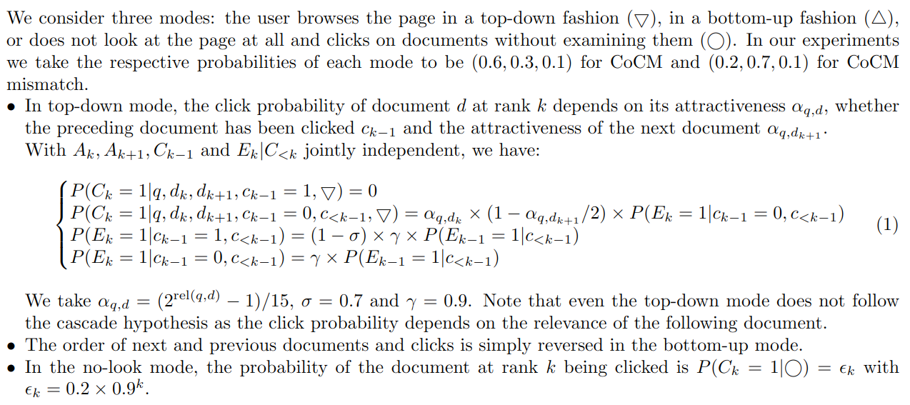
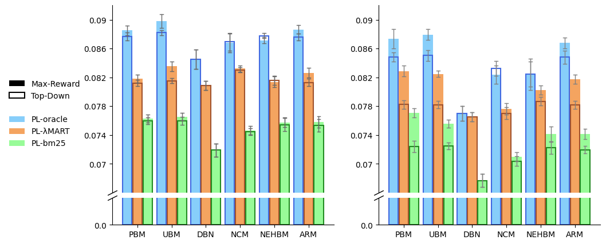

# Evaluating the Robustness of Click Models to Policy Distributional Shift

This repository contains the supporting code and implementation details for our paper _Evaluating the Robustness of Click Models to Policy Distributional Shift_

## Appendix

### Data Processing

**Real-world datasets** :
We first break down sessions into separate SERPs as we do not wish to use the additional information contained in a session beyond the current page. Then, we restrict the dataset to queries that have been annotated. Finally, we discard all pages without clicks. After pre-processing, the Yandex dataset contains 255,467 unique documents and 4,991 unique queries and the CLARA dataset contains 1,345,880 unique documents and 1,507 unique queries. Both datasets have a cutoff rank of 10. 

For perplexity computation, we use a chronological split where the test and validation set both represent 1/30th of the full Yandex dataset and 1/20th of the full CLARA dataset.

For the nDCG computation, we remove documents which do not appear in the dataset as well as queries whose remaining documents all have equal relevance, as they would output a nDCG of 1 regardless of the quality of the click model.

**Real-world data for simulated datasets** :
We restrict the [MSLR-WEB10K](https://www.microsoft.com/en-us/research/project/mslr/) dataset to 1000 random queries which all have at least 10 documents of not-all-equal relevance. The BM25 policy is extracted directly from the features in the dataset, while the Lambdamart policy is trained by us on all features available in the dataset. To make our work more easily reproducible, we directly provide a file with relevance scores from the trained Lambdamart policy. We rescale the relevance scores of both policies such that for each query the minimum score is 0 and the maximum score is 1.

### Simulator details

**Full definition of the Complex Click Model (CoCM)** :



**Query distribution** : By fitting a power-law model onto the CLARA data, we find that the k-th most frequent query appears with probability , and we adopt this query distribution for the simulated data.

**Near-oracle suboptimality** : We add a centered Gaussian perturbation with variance 0.1 to the rescaled relevances .

**Plackett-Luce-induced Stochasticity** : The policies used for training are made stochastic by sampling from a Plackett-Luce model. In practice we use the Gumbel sampling trick (used for example [here](https://arxiv.org/abs/2105.00855)) with a temperature specific to each policy : 0.1 for the noisy oracle and the Lambdamart policy and 0.03 for bm25. The training policies are therefore stochastic but rather narrow.

### Click model implementation and training
All click models are implemented in [PyTorch](https://pytorch.org/) with [PyTorch-Lightning](https://www.pytorchlightning.ai/). They are trained using the Adam Optimizer with the [ReduceLROnPlateau](https://pytorch.org/docs/stable/generated/torch.optim.lr_scheduler.ReduceLROnPlateau.html) scheduler with a factor of 0.5 and patience of 2. We use [Early Stopping](https://pytorch-lightning.readthedocs.io/en/latest/common/early_stopping.html) with patience of 3 to stop the training when the validation loss does not improve and restore the best checkpoint for evaluation on the test set. We trained these models on a single nVIDIA V100 GPU and no models required more than 10 minutes to be trained on the simulated datasets.


We provide below architecture diagrams for the 6 click models used in our experiments :

**PBM** : 


**UBM** :


**DBN** : 


**NCM** : 


**NEHBM** : 


**ARM** : 


### Supplementary results

**Confidence bounds of Table 1 (CLARA)** :
| Model  | Avg PPL | PPL@1 | PPL@2 | PPL@5 | PPL@10 | nDCG@1 | nDCG@3 | nDCG@5 | nDCG@10 |
| ------------- | ------------- | ------------- | ------------- | ------------- | ------------- | ------------- | ------------- | ------------- | ------------- |
| Weighted TopObs  | -- | -- | -- | -- | -- | 0.7911 (+- 0.0002) |	0.8360 (+- 0.0000) |	0.8695 (+- 0.0001) |	0.9167 (+- 0.0000) |
| TopPopObs | -- | -- | -- | -- | -- | 0.7797 (+- 0.0009) |	0.8283 (+- 0.0008) |	0.8652 (+- 0.0007) |	0.9137 (+- 0.0003) |
| TopPop | -- | -- | -- | -- | -- | 0.7782 (+- 0.0014) |	0.8285 (+- 0.0011) |	0.8646 (+- 0.0008) |	0.9136 (+- 0.0004) |
| dCTR | 1.1413 (+- 0.0000) |	1.4000 (+- 0.0000) |	1.2502 (+- 0.0000) |	1.1333 (+- 0.0000) |	1.0515 (+- 0.0000) |	0.7445 (+- 0.0010) |	0.7881 (+- 0.0005) |	0.8323 (+- 0.0004) |	0.8954 (+- 0.0002) |
| drCTR  | 1.1381 (+- 0.0000) |	1.3932 (+- 0.0000) |	1.2413 (+- 0.0000) |	1.1311 (+- 0.0000) |	1.0500 (+- 0.0000) |	0.7227 (+- 0.0000) |	0.7762 (+- 0.0001) |	0.8224 (+- 0.0000) |	0.8872 (+- 0.0000) |
| PBM  | 1.1445 (+- 0.0014) |	1.3955 (+- 0.0084) |	1.2523 (+- 0.0009) |	1.1368 (+- 0.0006) |	1.0546 (+- 0.0005) |	0.6801 (+- 0.0051) |	0.7396 (+- 0.0029) |	0.7993 (+- 0.0019) |	0.8736 (+- 0.0016) |
| UBM  | 1.1410 (+- 0.0000) |	1.3906 (+- 0.0003) |	1.2431 (+- 0.0002) |	1.1343 (+- 0.0001) |	1.0519 (+- 0.0002) |	0.6825 (+- 0.0039) |	0.7411 (+- 0.0023) |	0.8002 (+- 0.0016) |	0.8744 (+- 0.0012) |
| DBN  | 1.1386 (+- 0.0013) |	1.3936 (+- 0.0061) |	1.2282 (+- 0.0009) |	1.1283 (+- 0.0008) |	1.0523 (+- 0.0005) |	0.6665 (+- 0.0067) |	0.7355 (+- 0.0030) |	0.7967 (+- 0.0023) |	0.8715 (+- 0.0016) |
| NCM  | 1.1371 (+- 0.0002) |	1.3994 (+- 0.0034) |	1.2274 (+- 0.0005) |	1.1254 (+- 0.0007) |	1.0497 (+- 0.0002) |	0.6554 (+- 0.0047) |	0.7311 (+- 0.0027) |	0.7942 (+- 0.0022) |	0.8688 (+- 0.0011) |
| NEHBM  | 1.1417 (+- 0.0018) |	1.3962 (+- 0.0085) |	1.2437 (+- 0.0009) |	1.1337 (+- 0.0010) |	1.0519 (+- 0.0009) |	0.6808 (+- 0.0042) |	0.7406 (+- 0.0017) |	0.8001 (+- 0.0010) |	0.8740 (+- 0.0010) |
| ARM  | 1.1438 (+- 0.0014) |	1.3994 (+- 0.0066) |	1.2478 (+- 0.0007) |	1.1350 (+- 0.0007) |	1.0566 (+- 0.0010) |	0.6861 (+- 0.0076) |	0.7442 (+- 0.0027) |	0.8027 (+- 0.0018) |	0.8760 (+- 0.0015) |
| ARM NC  | -- | -- | -- | -- | -- | 0.6930 (+- 0.0048) |	0.7456 (+- 0.0015) |	0.8035 (+- 0.0012) |	0.8768 (+- 0.0012) |

**Confidence bounds of Table 2 (Yandex)** :
| Model  | Avg PPL | PPL@1 | PPL@2 | PPL@5 | PPL@10 | nDCG@1 | nDCG@3 | nDCG@5 | nDCG@10 |
| ------------- | ------------- | ------------- | ------------- | ------------- | ------------- | ------------- | ------------- | ------------- | ------------- |
| Weighted TopObs  | -- | -- | -- | -- | -- | 0.7138 (+- 0.0002) |	0.7003 (+- 0.0001) |	0.7291 (+- 0.0001) |	0.8034 (+- 0.0001) |
| TopPopObs | -- | -- | -- | -- | -- | 0.7206 (+- 0.0009) |	0.7023 (+- 0.0009) |	0.7319 (+- 0.0005) |	0.8056 (+- 0.0005) |
| TopPop | -- | -- | -- | -- | -- | 0.7225 (+- 0.0007) |	0.7110 (+- 0.0010) |	0.7374 (+- 0.0004) |	0.8097 (+- 0.0005) |
| dCTR | 1.3212 (+- 0.0000) |	1.6054 (+- 0.0000) |	1.5581 (+- 0.0000) |	1.2901 (+- 0.0000) |	1.1790 (+- 0.0000) |	0.7246 (+- 0.0010) |	0.7165 (+- 0.0006) |	0.7456 (+- 0.0005) |	0.8155 (+- 0.0003) |
| drCTR  | 1.3146 (+- 0.0000) |	1.5784 (+- 0.0000) |	1.5439 (+- 0.0000) |	1.2895 (+- 0.0000) |	1.1764 (+- 0.0000) |	0.6273 (+- 0.0002) |	0.6531 (+- 0.0001) |	0.6989 (+- 0.0001) |	0.7795 (+- 0.0001) |
| PBM  | 1.3177 (+- 0.0013) |	1.5970 (+- 0.0039) |	1.5488 (+- 0.0016) |	1.2884 (+- 0.0009) |	1.1781 (+- 0.0011) |	0.5977 (+- 0.0076) |	0.6243 (+- 0.0044) |	0.6734 (+- 0.0038) |	0.7621 (+- 0.0028) |
| UBM  | 1.2823 (+- 0.0011) |	1.5918 (+- 0.0035)	| 1.5366 (+- 0.0018) |	1.2463 (+- 0.0009) |	1.1247 (+- 0.0011) |	0.6017 (+- 0.0083) |	0.6255 (+- 0.0050) |	0.6734 (+- 0.0033) |	0.7631 (+- 0.0024) |
| DBN  | 1.2803 (+- 0.0008) |	1.5861 (+- 0.0019) |	1.5200 (+- 0.0012) |	1.2463 (+- 0.0006) |	1.1271 (+- 0.0025) |	0.5785 (+- 0.0065) |	0.6096 (+- 0.0030) |	0.6610 (+- 0.0024) |	0.7529 (+- 0.0018) |
| NCM | 1.2717 (+- 0.0011) |	1.5842 (+- 0.0023) |	1.5141 (+- 0.0025) |	1.2361 (+- 0.0011) |	1.1152 (+- 0.0008) |	0.5606 (+- 0.0057) |	0.5987 (+- 0.0043) |	0.6518 (+- 0.0036) |	0.7462 (+- 0.0027) |
| NEHBM  | 1.2789 (+- 0.0013) |	1.5969 (+- 0.0054) |	1.5443 (+- 0.0032) |	1.2405 (+- 0.0009) |	1.1165 (+- 0.0004) |	0.5648 (+- 0.0105) |	0.6008 (+- 0.0063) |	0.6546 (+- 0.0048) |	0.7485 (+- 0.0036) |
| ARM  | 1.3147 (+- 0.0023) |	1.6142 (+- 0.0069) |	1.5755 (+- 0.0033) |	1.2719 (+- 0.0012)	 | 1.1807 (+- 0.0042) |	0.5993 (+- 0.0048) |	0.6258 (+- 0.0030) |	0.6730 (+- 0.0022) |	0.7616 (+- 0.0018) |
| ARM NC  | -- | -- | -- | -- | -- | 0.6086 (+- 0.0084) |	0.6279 (+- 0.0050) |	0.6756 (+- 0.0040) |	0.7634 (+- 0.0033) |

**Confidence bounds of Table 3** :
| Model  | ind-PPL | nDCG@3 | ood-PPL | 
| ------------- | ------------- | ------------- | ------------- | 
| DBN Oracle  | 1.2856 (+- 0.0000) | 1.0 (+- 0.0000) | 1.3002 (+- 0.0000) | 
| DBN  | 1.3230 (+- 0.0005) | 0.7784 (+- 0.0136) | 1.3355 (+- 0.0016) | 
| dCTR  | 1.3428 (+- 0.0000) | 0.9219 (+- 0.0015) | 1.4683 (+- 0.0000) | 
| PBM  | 1.3336 (+- 0.0005) | 0.8482 (+- 0.0033) | 1.3561 (+- 0.0023) | 
| UBM  | 1.3271 (+- 0.0005) | 0.8580 (+- 0.0000) | 1.3413 (+- 0.0011) | 
| NCM  | 1.3248 (+- 0.0002) | 0.7851 (+- 0.0124) | 1.3501 (+- 0.0027) | 
| NEHBM  | 1.3270 (+- 0.0005) | 0.8119 (+- 0.0116) | 1.3414 (+- 0.0010) | 
| ARM NC | 1.2429 (+- 0.0003) | 0.9315 (+- 0.0021) | 1.6100 (+- 0.0074) | 

**Confidence bounds of Table 4** :
| Model  | ind-PPL | nDCG@3 | ood-PPL | 
| ------------- | ------------- | ------------- | ------------- | 
| CoCM Oracle  | 1.2670 (+- 0.0000) | 1.0 (+- 0.0000)@1 | 1.2611 (+- 0.0000) | 
| dCTR  | 1.3025 (+- 0.0000) | 0.8476 (+- 0.0018) | 1.3485 (+- 0.0000) | 
| PBM  | 1.3036 (+- 0.0003) | 0.7475 (+- 0.0135) | 1.3030 (+- 0.0011) | 
| UBM  | 1.2945 (+- 0.0004) | 0.7677 (+- 0.0137) | 1.2949 (+- 0.0007) | 
| DBN  | 1.2973 (+- 0.0003) | 0.6674 (+- 0.0111) | 1.3040 (+- 0.0006) | 
| NCM  | 1.2948 (+- 0.0003) | 0.6723 (+- 0.0105) | 1.3067 (+- 0.0009) | 
| NEHBM  | 1.2928 (+- 0.0002) | 0.7019 (+- 0.0151) | 1.2934 (+- 0.0011) | 
| ARM NC  | 1.1891 (+- 0.0003) | 0.8765 (+- 0.0029) | 1.7012 (+- 0.0108) | 

**Confidence bounds on Figure 2**:


## Repository Usage

### Getting started

The code was tested with python 3.7.4 on a CentOS 7 machine.
```
pip install -r requirements.txt
```

### To preprocess yandex data
1. Download [Yandex]() relevance prediction dataset and your desired path.
2. Execute the following scripts :
```
 python utils/parse_yandex.py --path [path]
 python utils/preprocess_dataset.py --dataset [path/serp_based]
 python utils/filter_ground_truth.py --dataset [path/serp_based]
```
Now the Yandex data is ready to train !

### To generate the simulated data :
1. Download the [MSLR-WEB10K](https://www.microsoft.com/en-us/research/project/mslr/) dataset.
2. Put the ```Fold1``` folder in your desired path.
3. Add lambdmart policy's [two](./utils/lambdamart.pt) [files](./utils/lambdamart_sampled.pt) in the same directory 
4. ``` python generate_data.py ```


This will generate datasets for 3 different internal click models (DBN, CoCM, CoCM mismatch), each with 3 training policies (PL-oracle, PL-bm25, PL-lambdamart), each with 4 test policies (oracle, random, bm25, lambdamart), as well as the data required for the experiment in Section 6.1 if you switch gen_sample10 to True.

### To launch click model training on a specific dataset:
```
python train_click_models.py --cm=[CLICK MODEL] --sl=[STATE LEARNER] --data_dir [path/to/dataset/directory/] [--hp_name hp_value] 
```
This will train the desired click model on the dataset given as argument, save perplexity and NDCG results in ```data_dir/results/```, and save the best checkpoint in ```data_dir/checkpoints/```.

:warning: You must use the format ```--cm=XXX``` instead of ```--cm XXX```.

A complete list of default hyperparameters can be found in [```argument_parser.py```](./modules/argument_parser.py) for program-wide parameters and in [```click_models.py```](./modules/click_models.py) or [```state_learners.py```](./modules/state_learners.py) for model-specific parameters. We provide configuration files for reproducing the experiments in the paper in the [```config```](./config/) folder : [```specs_yandex.yml```](./config/specs_yandex.yml) for reproducing Table 2, [```specs_random_rerank.yml```](./config/specs_random_rerank.yml) for reproducing the in-distribution results of Tables 3 and 4, and [```specs_sim.yml```](./config/specs_sim.yml) for reproducing the red dashed line in Figure 1, after having generated the data.

### To launch in debugging mode (few iterations of test, and NDCG evaluation) :
Add  ``` --debug True``` 

### To run an experiment on robustness of click prediction (after training) :
```
python gen_eval.py --cp_name [checkpoint_filename] --dataset [path/to/dataset/directory/]
```
This will load the checkpoint ```dataset/checkpoints/cp_name``` and test it on all the target datasets present in the folder (by default oracle, random, bm25 and lambdamart). Ood-perplexity results are saved in ```dataset/target_dataset/results/```. We provide configuration files for reproducing the experiments in the paper in the [```config```](./config/) folder : [```specs_random_rerank_ood.yml```](./config/specs_random_rerank_ood.yml) for reproducing the out-of-distribution results of Tables 3 and 4, and [```specs_sim_ood.yml```](./config/specs_sim_ood.yml) for reproducing the blue line in Figure 1.

### To plot a similar spider chart as Figure 1 in the paper (after the robustness of click prediction experiment)
```
python spider_chart_gen_eval.py --path [path/to/datasets/directory/]
```
This will read results and plot them in an interpretable fashion. The figure is saved in ```path/gen_eval.png```.


### To run an experiment on robustness of subsequent policies (after training) :
```
python policy_eval.py --cp_name [checkpoint_filename] --dataset [path/to/dataset/directory/]
```
This will load the checkpoint ```dataset/checkpoints/cp_name```, extract the Top-Down and Max-Reward policies corresponding to this checkpoint, generate datasets with these policies and save the CTR of these datasets in ```dataset/policies/```. We provide configuration files for reproducing the experiments in the paper in the [```config```](./config/) folder : [```specs_pol.yml```](./config/specs_pol.yml) for reproducing the results displayed in Figure 2.

### To plot a similar bar chart as Figure 2 in the paper (after the robustness of policies experiment) :
```
python bar_chart_policy_eval.py --path [path/to/datasets/directory/]
```
This will read results and plot them in an interpretable fashion. The figure is saved in ```path/policy_eval.png```.
